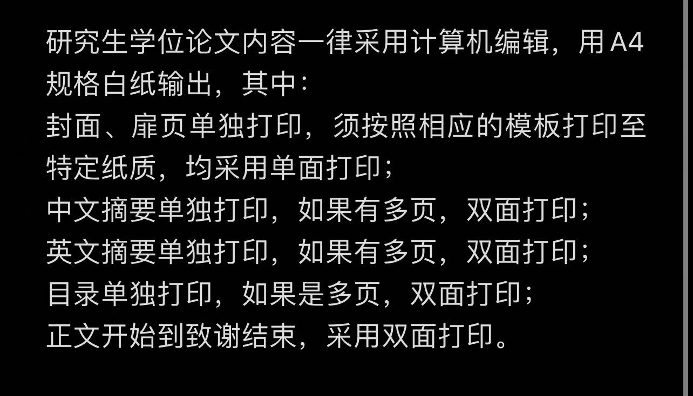
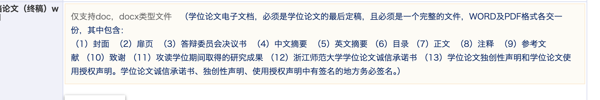

# phd-master-latex
# 浙师大毕业论文latex模板

## 总体介绍

本模板为浙江师范大学理工科官方模板，用于硕士、博士毕业论文的撰写使用。基本的使用方法请参阅main.tex文件里的内容。

==本模板建议配合overleaf软件使用，使用起来方便简洁。只需要将本项目整个下载为zip文件，然后上次至overleaf即可，编译时选择Xelatex即可。==

paper.tex 论文的主文件

main.tex 说明文件

**重要文件，请勿删除preparations目录下的任何文件，里面包含的是字体、中文格式以及原创性申明等内容**

chapters/ 论文的主要目录

figures/ 论文的图片目录。该目录可以根据自己的需要自行调整。

如果要在本地搭建tex编译环境，请参阅main.tex里的配置流程。

如果要在本地搭建overleaf环境（免费，在线版官方版overleaf编译大文件需要开通会员，不然编译会超时。），请参阅：
该博文：
https://blog.csdn.net/yitingren5764/article/details/121377630

更多详细的操作和方法请参阅：
https://www.notion.so/Overleaf-41925eff9a874b17afa385025b85ea6f

316实验室我的服务器上已经配置了本地overleaf环境，需要的同学可以去试试。

#### 毕业论文的内容章节顺序

#### 毕业论文的打印要求

提交的论文电子版和打印版必须完全一致。这里的完全一致是指有页码的部分，电子版和打印版的页码及相应的内容必须完全一致，而打印版中的空白页是没有页码的。因此，我们只需要保证电子版的正文中没有任何空白页即可，打印时让打印店老板帮忙加上没有页码的空白页即可。

#### 去除文本中的所有空白页

paper.tex中添加

\let\cleardoublepage\clearpage % 去除空白页

---

#### 去掉独创性申明和诚信承诺书之间的空白页

statement.tex中添加，去掉之间的空白页

%%以下这四行代码是在该页面之前加入一页空白页！！  
% \newpage  
% \thispagestyle{empty}  
%  
% \newpage
%%

---

#### 致谢和独创性声明处的页眉页脚问题

\pagestyle{plain}  
\fancyfoot[C]{\thepage} % 页码  
% \fancyhead[C]{}

在致谢页添加以上代码，将只保留页脚的页码，去掉页眉。

---
#### 正文里有四级标题，但是目录中不显示的问题

在Latex中，通常编号到subsubsection，book类型的目录默认只显示到subsection，但是如果需要使用更深的目录或章节编号，需要在导言区进行如下设置：

\setcounter{tocdepth}{3}：toc即table of content，表示目录显示的深度
\setcounter{secnumdepth}{4}：secnum即section number，表示章节编号的深度
其中的数字3和4表示深度，具体数字的含义如下：

-1 part
0 chapter
1 section
2 subsection
3 subsubsection
4 paragraph
5 subparagraph

通过在paper.tex 中增加这两个代码即可按照自己的意愿在目录中显示四级章节标题，但是排版会很乱，酌情使用。
‍\setcounter{tocdepth}{3}：toc即table of content，表示目录显示的深度
\setcounter{secnumdepth}{4}：secnum即section number，表示章节编号的深度

在.cls模板文件中修改这些内容也可以。

---
#### 页眉页脚的使用

latex页眉页脚的问题请参考该文：
https://mathpretty.com/13753.html